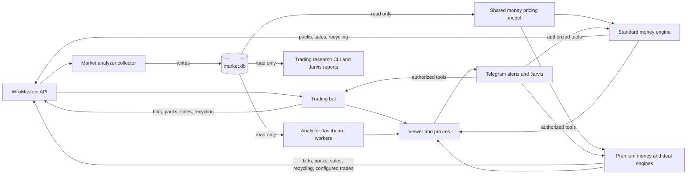

# WikiMasters project overview

This project runs several automated helpers for WikiMasters, a game where cards
represent French Wikipedia articles. The trading bot builds a collection chosen
by the owner. The market analyzer records auction evidence. Two money accounts
use that evidence to turn cards into coins, with the premium account also buying
cards for resale. A separate viewer provides phone access and hosts the Telegram
notification service and Jarvis assistant.

This is the starting context for future Codex chats. It describes the source as
reviewed on 2026-10-04, including local work present at that time. It does not
snapshot personal settings, balances, credentials or current process status.

## Components and accounts

| Component | Purpose | Process entry point | Default dashboard |
| --- | --- | --- | --- |
| [Trading bot](trading-bot.md) | Acquire collection targets; optionally open packs, sell and recycle by rules | `src/bot.js` | `http://localhost:8787` |
| [Market analyzer](market-analyzer.md) | Discover listings, record outcomes/bids and analyze history | `market-analyzer/src/main.js` | `http://localhost:8788` |
| [Standard money bot](money-bot-standard.md) | Open packs and allocate sale slots to useful cards | `money-bot/src/main.js` | `http://localhost:8789/` |
| [Premium money bot](money-bot-premium.md) | Premium sales and evidence-based acquisition for resale | Same money process | `http://localhost:8789/premium/overview` |
| [Viewer](viewer.md) | Combined status and dashboard proxies for phone access | `viewer/server.js` | `http://localhost:8790` |
| [Jarvis](jarvis.md) | Telegram AI assistant with permission-checked bot tools | Started through the viewer's Telegram service | Telegram `/jarvis` |

Trading uses its own game login. The analyzer supports up to three other logins:
accounts 1 and 2 collect results; account 3 scouts listings. Standard and premium
money accounts each need another distinct login. Money account connection checks
reject identities already used by the other money account, trading bot or analyzer.
The viewer and Jarvis access these existing services; they do not need a new game
account. Additional named trading instances can be registered with Jarvis, but
registration does not create a process or an account.

## How the pieces fit together

The analyzer is the writer of `market-analyzer/market.db`. Money pricing, trading
research commands and Jarvis reports read it. The trading bot can run its rule
strategy without that database; local sale-history research then becomes
unavailable. Money decisions require available, sufficiently fresh settled
market history. The viewer can run when a bot is offline and reports that state.
Core bot loops do not depend on Jarvis or the optional strategy agent.

## Terms that matter

- **Card ID:** the game card/article identity used for research and targets.
- **Exact variant:** card ID plus rarity and shiny status. Different variants
  should not be treated as interchangeable price or demand evidence.
- **Owned copy ID:** a particular inventory item, often named `userCardId` in the
  money code. A returned unsold card can receive a different copy ID.
- **Auction ID:** a specific listing, distinct from both card and copy identity.
- **Watchlist versus funded plan:** a premium candidate can be observed without
  reserving money. A funded plan is scheduled and consumes cash/capacity.
- **Sold versus unsold:** a listing or bid is not a realized sale. Sale reports
  use finalized `settled_sold` records. Unsold outcomes matter for pricing.
- **Dry run:** suppresses game mutations, but can still read the site and write
  local configuration, checkpoints, logs and simulated outcomes.

## Starting and stopping

Use Node 22.13 or newer for all components. Root trading declares Node 20+, but
its optional SQLite research and the other packages require the newer runtime.
There are no declared third-party package dependencies in the three manifests.

| Task | Command and working directory | Important behavior |
| --- | --- | --- |
| Trading preview | Root: `npm start` | No `--live`, so game actions stay dry-run |
| Trading live-capable process | Root: `npm run live` | Requires `config.json` with `dryRun: false` too |
| Supervised trading on Windows | Root: `start-bot.bat` | Stops old trading processes, then supervises with `--live`; logs to `bot.log` |
| Analyzer | `market-analyzer/`: `npm start` or `start-market.bat` | Records auctions; does not trade |
| Both money previews | `money-bot/`: `npm start` | Both accounts dry-run |
| Standard live-capable only | `money-bot/`: `npm run live` or `start-money.bat` | Premium remains dry-run |
| Premium live-capable only | `money-bot/`: `npm run live-premium` | Standard remains dry-run |
| Both money accounts live-capable | `money-bot/`: `npm run live-both` | Each still requires its own `dryRun: false` |
| Viewer and optional Telegram service | Root: `node viewer/server.js` or `start-viewer.bat` | Does not launch the game bots |

For a complete startup, run the analyzer first and let it record settled data,
then run the money process. Trading and viewer can start independently. Connect
game accounts through their dashboards; sessions renew locally. Stop foreground
Node processes with Ctrl+C. Supervised trading has `stop-bot.bat`; closing a
supervisor or restarting a bot is an operational action, not a read-only check.

## Where context and state live

| Location | Contents |
| --- | --- |
| `src/` | Trading engine, rules, timing, session, dashboard, strategy CLI |
| `market-analyzer/src/` | Collector, account pool, SQLite writer, analysis workers, dashboard |
| `money-bot/src/` | Two money engines, shared model, premium deal engine, accounting, dashboard |
| `viewer/` | Phone status, proxies, Telegram service, Codex bridge and tool broker |
| `docs/` | This overview and the component context guides |
| Root `config.json`, `targets.json`, `limits.json`, `strategy.md` | Personal trading settings, goals and ceilings |
| Root `bids.jsonl`, `cards.jsonl`, `journal.jsonl`, `values.json` | Trading attempts, durable card events, strategy journal, valuation cache |
| `market-analyzer/market.db` | Recorded listings, outcomes, bids, players and cards |
| `money-bot/state*.json`, `events*.jsonl` | Account checkpoints and durable money history |
| `%LOCALAPPDATA%\WikiMastersBot` | Telegram access/subscriptions, saved media and Jarvis change journal |

Each game component keeps its own `.env` and `.session*.json` files. Premium
money uses `.env.premium` and `.session.premium.json`. These and actual configs,
journals and database files are private runtime data. Refer to example configs
when documenting defaults; actual values may differ. Avoid broad file captures
or staging the entire worktree: some locally created runtime files may not yet
have ignore rules.

## How to approach a future task

Read [../AGENTS.md](../AGENTS.md), this overview, and the relevant component
guide. Inspect current code and existing changes before editing. Prefer dashboard
read endpoints and existing research commands over direct site requests. Use
component tests with temporary fixtures; starting a live process is not a test.

Keep account identity, card identity, owned copies and auction identity separate
in changes. Preserve durable event history and purchase cost attribution. Treat
slow analytics, collection gaps and stale pricing as different problems. Never
move an expensive analytical scan into the collector loop to simplify a feature.

Existing detailed references remain useful: [root setup](../README.md),
[trading policies](../POLICIES.md), [strategy agent manual](../AGENT.md),
[analyzer operations](../market-analyzer/README.md),
[money strategy details](../money-bot/README.md), and
[Jarvis permissions and tools](../viewer/JARVIS.md).
